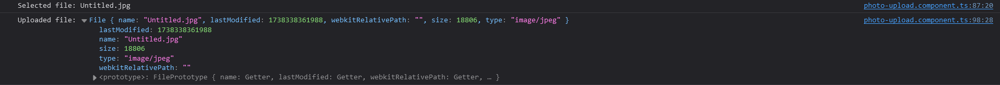

# **Blinq24/1**
### Product Vision
#### FOR (target customer)
FOR social media users and content creators enthusiastic about sharing visual moments.

#### WHO (statement of need or opportunity)
*The* users WHO want to share photos instantly with control over visibility and a limited lifespan.

#### THE (Blinq24/1) is a (product category)
Blinq24/1 is a photo-sharing platform with temporary visibility.

#### THAT (key benefit, compelling reason to buy)
THAT allows users to upload photos visible for 24 hours with customizable audience settings.

#### UNLIKE (primary competitive alternative)
UNLIKE permanent social media platforms or complex privacy settings, which may compromise user control.

#### OUR PRODUCT (statement of primary differentiation)
OUR PRODUCT provides a simple, temporary photo-sharing experience with full control over who sees your content, ensuring privacy and spontaneity.

### Product Features
- Photo Upload: Users can upload images from their devices.
- Custom Visibility: Users can choose to make photos visible to a group of people or to the public.
- Automatic Deletion: Photos are automatically deleted 24 hours after being uploaded.
- Authentication and Authorization: Users must be authenticated to upload photos and view content shared with restricted groups.
- Group Creation and Management: Users can create groups and add members to share photos with them.
- Temporary Photo Gallery: Photos are displayed in temporary galleries that disappear after 24 hours.
- User-Friendly Interface: The interface, built with Angular, is intuitive and easy to use.
- Notifications: Users receive notifications when a photo is uploaded to groups they are part of.

### Demo

### Planning
We approached the Kanban methodology for task solving. We created tasks (issues) from user stories (milestones) and solved depending on their priority, without any sprints.

### UML Diagrams
#### Class Diagram

#### Component Diagram

#### Container Diagram

### Scenarios:
#### 1. Eugenia, a social media content creator wants to share a photo from a recent photo shoot but doesn’t want it to stay on her profile permanently. She uploads the photo to Blinq24/1 and sets the visibility to her “close friends group”. The photo will remain visible for 24 hours and will only be accessible to the friends Ana has inside of the group. After 24 hours, the photo will be automatically deleted, and Eugenia doesn’t have to worry about it staying on the internet.
#### 2. Ramon Popescu, a user who prioritizes privacy, wants to share a photo with his family members only. He creates a group on Blinq24/1 titled “Family” and adds the relevant members to it. When uploading the photo, he selects visibility settings to make it viewable only to the “Family” group. The photo is accessible only to the “Family” group members and will automatically be deleted after 24 hours, ensuring the privacy of his content.
#### 3. Gratiela, a new user looking for a quick experience, opens Blinq24/1 and registers. After authenticating, she can start uploading photos immediately. The app’s interface guides her through the process, allowing her to set her desired audience. Gratiela enjoys an intuitive and simple experience, making it easy to quickly share temporary photos without complicated privacy settings.
#### 4.	Eusebiu Vicentiu, a businessman who interacts with multiple groups of people ,on a daily basis, wants an easier way of sending different photos to different groups without having to worry about showing the wrong people his photos. Before sending the photo he either creates a group or chooses one that he already created , in which he can select which people are part of that group from his friends list. This allows him to send a photo to multiple people that do not know each at once without having to do so separately.

### Manual Testing
#### Task: As a Blinq24/1 developer, I want to manually test if my photo has been sent.

#### Task: As a Blinq24/1 user, I want to manually test if friends are added to a group.

#### Task: As a Blinq24/1 user, I want to manually test if the friends are added to my list.

### QA
#### Objectives
- Artifacts: Backend functionality for login and register and full stack functionality for photo uploading, adding friends and populating groups.
- Testing Levels: Unit testing and acceptance testing
#### Process
- Unit testing: Applied during the development phase
- Manual testing: Applied during the deployment phase
#### Testing methods
- Unit testing: Used during development to ensure the critical parts (login and register) are working fine
- Manual testing: Used to ensure the main features are working after release
#### Results
- After manual testing, few changes were made, such as adding error feedback and redirects to other components

### [Security analysis](security_analysis.md)

### CI/CD
- We used only a development environment, because we didn't find a use case for a production environment, since there was no connection string to change, or artifact to deploy.
- We used a Continuous Integration (CI) script, running on Github Actions on every push, with the following stages combined in one job:
  - build
  - test
  - create a unit test report: 

